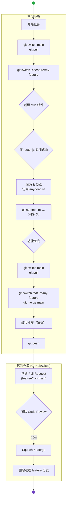

# Vue 团队 Git 工作流

本规范为小型 Vue.js 项目团队设计，采用以 `main` 分支为中心的极简工作流。核心目标是保留 **路由驱动开发** 的优点，避免关键文件冲突，同时简化分支管理，让协作流程更轻快。

## 目录
- [Vue 团队 Git 工作流](#vue-团队-git-工作流)
  - [目录](#目录)
  - [1. 核心三大原则](#1-核心三大原则)
  - [2. 分支模型：一切围绕 Main](#2-分支模型一切围绕-main)
  - [3. 命名规范](#3-命名规范)
    - [3.1. 分支命名](#31-分支命名)
    - [3.2. Commit 消息规范](#32-commit-消息规范)
  - [4. 标准开发工作流（步骤详解）](#4-标准开发工作流步骤详解)
  - [5. 代码审查 (Code Review) 与合并](#5-代码审查-code-review-与合并)
  - [6. 附录：极简工作流速查图](#6-附录极简工作流速查图)

---

## 1. 核心三大原则

1.  **`main` 分支是唯一主干**: `main` 分支是项目的唯一稳定主干，代表了最新、可运行的代码。所有开发工作都从它开始，并最终合并回它。
2.  **`App.vue` 保持纯净**: `App.vue` 只作为顶层外壳（包含 `<router-view />`），**严禁** 为了测试单个组件而直接修改它。
3.  **路由驱动开发**: 所有新页面和功能，都必须通过在 `src/router/index.js` 中 **添加新路由** 来进行开发和预览。这是避免冲突的关键。

## 2. 分支模型：一切围绕 Main

我们只使用两种类型的分支：

| 分支类型 | 用途 | 生命周期 |
| :--- | :--- | :--- |
| `main` | 唯一的主分支，代表项目最新状态。 | 永久 |
| `feature/*` 或 `fix/*`| **（你的工作区）** 开发新功能或修复Bug。 | 从 `main` 创建，完成并通过审查后，合并回 `main`，然后删除。 |

## 3. 命名规范

### 3.1. 分支命名

*   **格式**: `type/short-description`
*   **`type`**:
    *   `feature`: 开发新功能（如：新图表、新页面）。
    *   `fix`: 修复现有代码中的 Bug。
    *   `chore`: 项目配置、文档等非功能性改动。
*   **`short-description`**: 用连字符 `-` 连接的简短英文描述。

**示例**:
*   `feature/add-sales-bar-chart`
*   `fix/tooltip-display-error`
*   `chore/update-readme`

### 3.2. Commit 消息规范

我们采用 [**Conventional Commits**](https://www.conventionalcommits.org/zh-hans/v1.0.0/) 规范，让提交历史一目了然。

*   **格式**: `<type>: <subject>`
*   **`<type>`**: `feat`, `fix`, `docs`, `style`, `refactor`, `chore` 等。
*   **`<subject>`**: 简短描述，动词开头。

**示例**:
*   `feat: add bar chart component for sales data`
*   `fix: correct tooltip positioning on hover`
*   `docs: update chart component usage instructions`

---

## 4. 标准开发工作流（步骤详解）

假设你的任务是：**“添加一个新的销售数据柱状图页面”**。

**第 1 步: 同步 `main` 分支**
开始新任务前，永远先确保你的本地 `main` 分支是最新版本。

```bash
git switch main
git pull origin main
```

**第 2 步: 创建你的功能分支**
从最新的 `main` 分支上，创建你自己的工作分支。

```bash
# 格式: git switch -c <type>/<description>
git switch -c feature/add-sales-bar-chart
```
现在，你可以在 `feature/add-sales-bar-chart` 分支上安全地进行任何修改，不会影响到 `main` 分支。

**第 3 步: 路由驱动开发（核心步骤）**

1.  **创建组件**: 在 `src/views` 或 `src/components` 目录下创建你的图表组件，例如 `SalesBarChart.vue`。

2.  **添加路由**: 打开 `src/router/index.js`，为你的新页面添加一条路由。

    ```javascript
    // src/router/index.js
    const routes = [
      // ... 其他已有路由
      {
        path: '/sales-chart', // 定义一个独一无二的访问路径
        name: 'SalesChart',
        component: () => import('@/views/SalesBarChart.vue') // 懒加载你的组件
      }
    ];
    ```

3.  **开发与预览**: 运行 `npm run serve`，然后在浏览器中直接访问 `http://localhost:8080/sales-chart`。现在你可以在这个独立的页面上尽情开发和调试，完全不用碰 `App.vue`。

**第 4 步: 频繁提交**
在开发过程中，将你的工作拆分成小的、有意义的提交。

```bash
# 完成图表基本结构
git add .
git commit -m "feat: create basic layout for sales bar chart"

# 添加了交互功能
git add .
git commit -m "feat: add interactive tooltips to chart bars"
```

**第 5 步: 合并前同步**
当你的功能开发完毕，准备提交代码审查（Pull Request）之前，需要将 `main` 分支上可能存在的、由你的队友提交的最新代码，同步到你的功能分支。

```bash
# 1. 切换到 main 分支并拉取最新代码
git switch main
git pull origin main

# 2. 切换回你的功能分支
git switch feature/add-sales-bar-chart

# 3. 将 main 的最新变更合并到你的分支
git merge main
```
*   **解决冲突**: 如果 `merge` 命令提示冲突（例如，你和队友都修改了同一个CSS文件），你需要手动打开冲突文件，解决标记（`<<<<<`, `>>>>>`）中的内容，然后 `git add <resolved-file>` 并 `git commit` 来完成合并。

**第 6 步: 推送并创建 Pull Request (PR)**
将你本地更新好的分支推送到远程仓库。

```bash
# -u 参数会自动设置上游分支，后续只需 git push
git push -u origin feature/add-sales-bar-chart
```
然后，在你的 Git 托管平台（如 GitHub, Gitee）上，创建一个从 `feature/add-sales-bar-chart` 到 `main` 的 **Pull Request** (或称 Merge Request)。

在 PR 的描述里写清楚：
*   **做了什么**: "新增了销售数据的柱状图展示页面。"
*   **如何测试**: "请访问 `/sales-chart` 路由查看效果。"
*   **(可选) 截图**: 附上一张新页面的截图。

---

## 5. 代码审查 (Code Review) 与合并

*   **团队成员**: 另外两名成员中的至少一人需要审查代码。他们会查看代码、在本地测试你的分支，并提出修改意见。
*   **合并**:
    1.  当 PR 被批准后，由项目负责人（或提交者自己）在 Git 平台上点击 **“Squash and Merge”**（压缩合并）按钮。
    2.  **为什么用 Squash and Merge?** 它能将你的功能分支上的所有零散提交（如 `feat: add layout`, `fix: typo`）合并成一个清晰的提交记录，再进入 `main` 分支。这让 `main` 分支的历史记录非常干净整洁。
    3.  合并后，记得在平台上勾选或手动 **删除已被合并的 `feature` 分支**，保持仓库清爽。

---

## 6. 附录：极简工作流速查图

